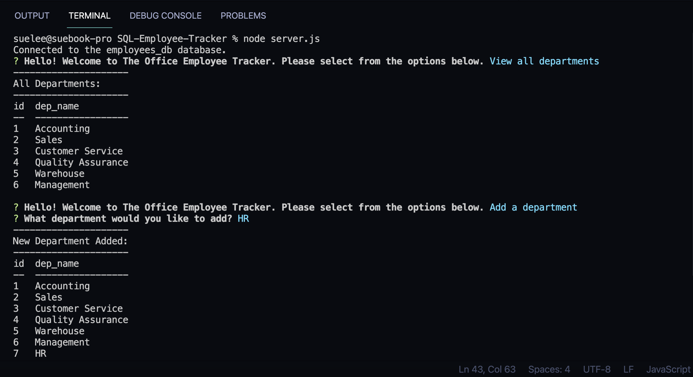

# SQL-Employee-Tracker

## Description
An employee tracker that uses Node.js command-line to interacts with an employee database. The user can view current database by department, roles, or employees. The user can also add a department, role or employee, as well as updating the role of an employee. The most up-to-date database can be seen as a table in the command-line for quick reference. 

## Installation
The employee tracker runs in the terminal and will be invoked by using the following command:

        node server.js

Packages needed to run components of this application: inquirer, MySQL2, and console.table.
- [Inquirer package](https://www.npmjs.com/package/inquirer)
- [MySQL2](https://www.npmjs.com/package/mysql2)
- [console.table](https://www.npmjs.com/package/console.table)

## Usage 
A command-line application that dynamically interacts with a database. 

## Link to demo:
https://youtu.be/At2G9kqsIgA

## Credits
- Sue Lee

## License
